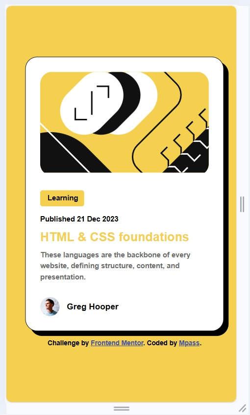
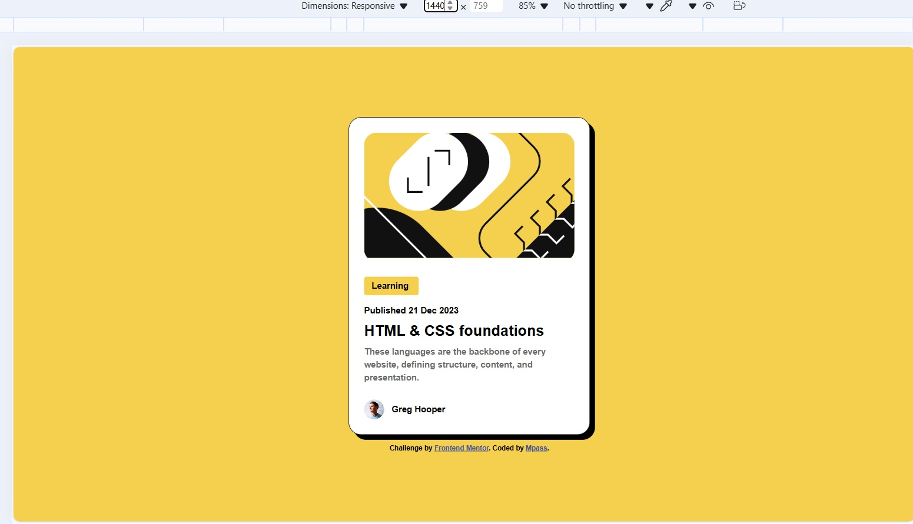
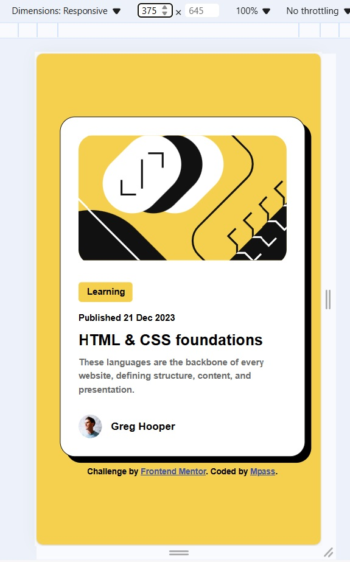

# Frontend Mentor - Blog preview card solution

This is a solution to the [Blog preview card challenge on Frontend Mentor](https://www.frontendmentor.io/challenges/blog-preview-card-ckPaj01IcS). Frontend Mentor challenges help you improve your coding skills by building realistic projects. 

## Table of contents

- [Overview](#overview)
  - [The challenge](#the-challenge)
  - [Screenshot](#screenshot)
  - [Links](#links)
- [My process](#my-process)
  - [Built with](#built-with)
  - [What I learned](#what-i-learned)
  - [Continued development](#continued-development)
  - [Useful resources](#useful-resources)
- [Author](#author)

**Note: Delete this note and update the table of contents based on what sections you keep.**

## Overview

### The challenge

Users should be able to:
:hover

### Screenshot

### Links

- Solution URL: [https://github.com/Benson0721/blog-card]
- Live Site URL: [https://benson0721.github.io/blog-card/]

## My process

### Built with

- Semantic HTML5 markup
- CSS custom properties
- Flexbox
- Mobile-first workflow
- SCSS

### What I learned
This is my first time following a mobile-first workflow to complete a project. Changing the logic from desktop-first to mobile-first is a bit of a challenge for me. I also found that my experience with using semantic HTML markup is not sufficient, so I must focus more on this aspect.

### Continued development
- Semantic HTML5 markup
- Mobile-first workflow
- SCSS
### Useful resources

- [https://internetingishard.netlify.app/html-and-css/responsive-design/] - This helped me understand what is mobile-first workflow. I really liked this website and will use it going forward.

## Author

- Website - [Mpass](https://github.com/Benson0721)
- Frontend Mentor - [Mpass](https://www.frontendmentor.io/profile/yourusername)
- Twitter - [@yourusername](https://www.twitter.com/yourusername)

